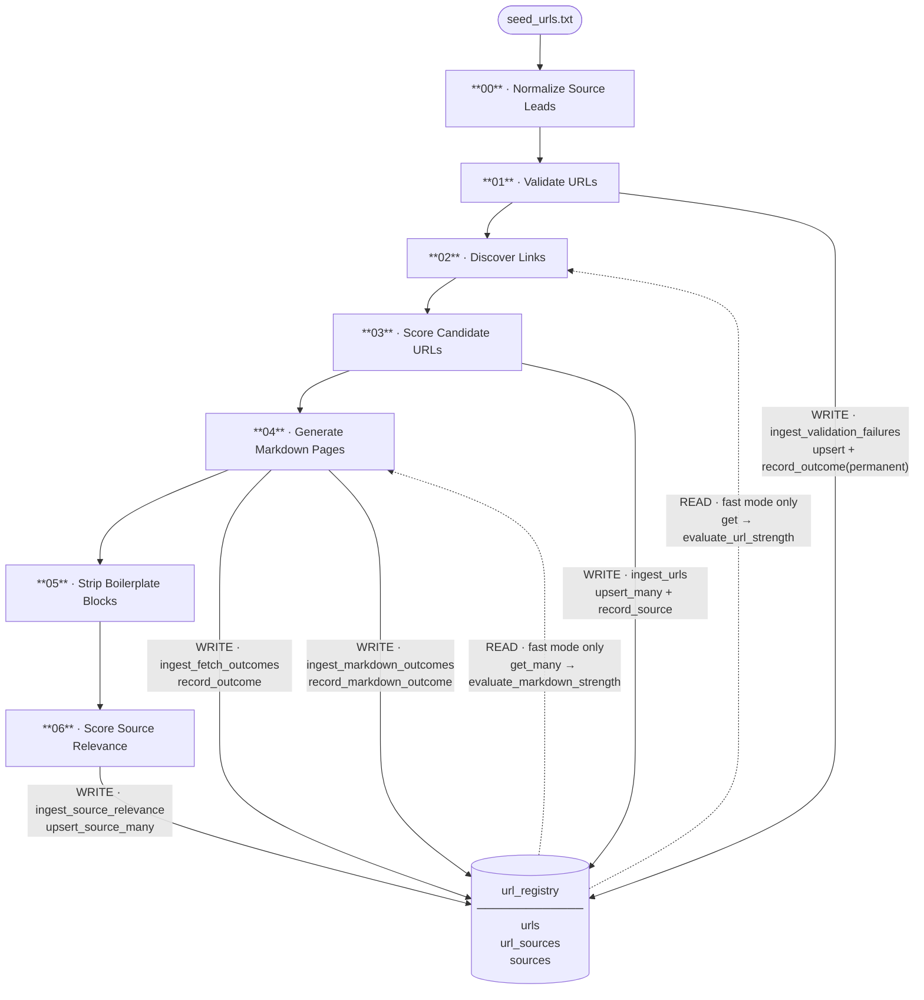

# Pipeline Orchestrator Design

## Purpose

The orchestrator is the top level controller for one 'farmles_harvester' run of a pipeline. It calls each stage
of the pipeline in order with the input and "StagePaths" and records the result returned.

It owns

- CLI arguments
- run folder creation if required.
- creates the output folder with <timestamp>_<user_tag>
- creates the `manifest.json` with run level metadata.

For each stage the orchestrator creates StagePaths. This has 
- absolute path to the output file
- absolute path to the summary file
- absolute path to the error file

For example for stage 00:

```
StagePaths(
    output_path=Path("/work/farmles_harvester/runs/2026-05-17_132400_initial-import/00_normalized_source_leads.jsonl"),
    summary_path=Path("/work/farmles_harvester/runs/2026-05-17_132400_initial-import/00_normalized_source_leads_summary.json"),
    errors_path=Path("/work/farmles_harvester/runs/2026-05-17_132400_initial-import/00_normalized_source_leads_errors.jsonl"),
)
```

Each stage returns StageResult
The orchestrator writes that result into manifest.json. 

- Stages never write directly to `manifest.json`. 
- use relative paths to the run directory inside `manifest.json`.
{
  "produced_artifacts": ["00_normalized_source_leads.jsonl"],
  "summary_artifact": "00_normalized_source_leads_summary.json",
  "error_artifact": "00_normalized_source_leads_errors.jsonl"
}

- If a stage fails then stop the run. 
	- Record failed StageResult in manifest.json and leave the artifacts in the run dir.

## File-Based Data Passing

The pipeline is file-based. Every stage reads from a JSONL file produced by the previous stage and writes its own JSONL output to the run directory. There is no in-memory handoff between stages.

**File naming convention:**

```
{stage_number}_{artifact_name}.jsonl          ← main output
{stage_number}_{artifact_name}_summary.json   ← stage summary
{stage_number}_{artifact_name}_errors.jsonl   ← processing errors
```

Example for stage 02:

```
02_discovered_links.jsonl
02_discovered_links_summary.json
02_discovered_links_errors.jsonl
```

**How paths are passed to stages:**

The orchestrator creates a [`StagePaths`](../farmles_harvester/pipeline/stage_paths.py) for each stage via `StagePaths.for_stage(run_dir, stage_number, artifact_name)`. It then passes the previous stage's `output_path` as the next stage's `input_path` — see [`orchestrator/run_pipeline.py`](../farmles_harvester/orchestrator/run_pipeline.py):

```python
paths_02 = StagePaths.for_stage(run_dir, "02", "discovered_links")

run_discover_links(
    input_path=paths_01.output_path,   # 01_validated_sources.jsonl
    stage_paths=paths_02,              # owns 02_discovered_links.*
    ...
)
```

Stages never construct their own paths or know about other stages. The orchestrator owns all wiring.

---

## Stage Artifacts — Summary and Errors

See [`reference/pipeline_artifacts.md`](reference/pipeline_artifacts.md) for a complete reference of every file the pipeline writes, including schemas and a full run directory layout.

Every stage produces three files. The main JSONL is the data artifact passed to the next stage. The other two are observability artifacts and are never read by downstream stages.

**`{stage}_summary.json`** — a single JSON object written after the stage completes. Contains record counts broken down by outcome (e.g. `valid_count`, `broken_count`, `timeout_count`), start/end timestamps, and stage identity. The orchestrator folds this into `manifest.json` via `StageResult`. Use it to understand what happened in a run without reading thousands of JSONL lines.

**`{stage}_errors.jsonl`** — one record per input that caused an unexpected stage-level failure — meaning the stage could not produce a normal output record for it. This is not where routine failures go. A 404, a timeout, a low score, or a skipped record are all normal outcomes and appear in the main output JSONL with an appropriate status field. Errors are for things the stage could not classify or handle: missing required input fields, unhandled exceptions, parser crashes.

The rule of thumb: if the stage knows what happened, it is an output record with a status. If the stage could not handle it at all, it is an error record.

---

## Implementation

**Entry point:** [`cli.py`](../farmles_harvester/cli.py) — `main()` parses CLI args, builds config, and calls `run_pipeline()`

**Orchestrator:** [`orchestrator/run_pipeline.py`](../farmles_harvester/orchestrator/run_pipeline.py) — `run_pipeline()` owns run-dir creation, stage sequencing, manifest updates, and registry lifecycle

**Call sequence (stages):**

| Stage | Source file | Entry function |
|---|---|---|
| 00 | [`stages/normalize_source_leads.py`](../farmles_harvester/stages/normalize_source_leads.py) | `run_normalize_source_leads()` |
| 01 | [`stages/validate_urls.py`](../farmles_harvester/stages/validate_urls.py) | `run_validate_urls()` |
| 02 | [`stages/discover_links.py`](../farmles_harvester/stages/discover_links.py) | `run_discover_links()` |
| 03 | [`stages/score_candidate_urls.py`](../farmles_harvester/stages/score_candidate_urls.py) | `run_score_candidate_urls()` |
| 04 | [`stages/generate_markdown_pages.py`](../farmles_harvester/stages/generate_markdown_pages.py) | `run_generate_markdown_pages()` |
| 05 | [`stages/strip_boilerplate_blocks.py`](../farmles_harvester/stages/strip_boilerplate_blocks.py) | `run_strip_boilerplate_blocks()` |
| 06 | [`stages/score_source_relevance.py`](../farmles_harvester/stages/score_source_relevance.py) | `run_score_source_relevance()` |

**Supporting modules:**
- [`orchestrator/manifest.py`](../farmles_harvester/orchestrator/manifest.py) — `create_initial_manifest()`, `record_stage_result()`
- [`pipeline/stage_paths.py`](../farmles_harvester/pipeline/stage_paths.py) — `StagePaths.for_stage()`
- [`pipeline/stage_result.py`](../farmles_harvester/pipeline/stage_result.py) — `StageResult` dataclass

**Registry ingestion** (non-fatal — warns but does not stop the pipeline):
[`orchestrator/registry_ingest.py`](../farmles_harvester/orchestrator/registry_ingest.py) — called after stages 01, 03, 04, 06. See [`docs/url_registry/url_registry.md`](url_registry/url_registry.md) for details.

---

## UrlRegistry Integration

[`registry/url_registry.py`](../farmles_harvester/registry/url_registry.py) is a SQLite-backed persistent store for tracking URLs across runs. The orchestrator instantiates one `UrlRegistry` at the start of `run_pipeline()` and closes it at the end. The default path is `{run_dir}/url_registry.db`; callers can supply a shared path to reuse the registry across multiple runs (required for fast mode to take effect).

**Reads** happen *during* stage execution and only when `fast_mode: true` is set in config and a cross-run registry is provided. **Writes** happen *after* each stage via `orchestrator/registry_ingest.py`. All ingestion calls are non-fatal — a failure warns but does not stop the pipeline.

| Stage | Direction | When | Operation | Purpose |
|---|---|---|---|---|
| 01 — Validate URLs | WRITE | After stage | `upsert()` + `record_outcome(permanent)` | Record seed URLs that failed validation as permanent failures |
| 02 — Discover Links | READ | During stage (fast mode only) | `get(url)` → `evaluate_url_strength()` | Skip crawling internal links already known as weak or permanently failed |
| 03 — Score Candidate URLs | WRITE | After stage | `upsert_many()` + `record_source()` | Persist discovered URLs with candidate scores and source mappings |
| 04 — Generate Markdown Pages | READ | During stage (fast mode only) | `get_many(urls)` → `evaluate_markdown_strength()` | Skip re-fetching candidates that already have sufficient markdown |
| 04 — Generate Markdown Pages | WRITE | After stage | `record_outcome()` + `record_markdown_outcome()` | Record HTTP fetch results and markdown word counts/paths |
| 06 — Score Source Relevance | WRITE | After stage | `upsert_source_many()` | Persist source-level relevance labels and keyword stats |

Fast-mode decision logic lives in [`registry/evaluation.py`](../farmles_harvester/registry/evaluation.py): `evaluate_url_strength()` (stage 02) and `evaluate_markdown_strength()` (stage 04).

---

## High-Level Flow Diagram

Solid arrows are **writes** (post-stage ingestion via `registry_ingest.py`). Dashed arrows are **reads** (fast-mode lookups during stage execution).


